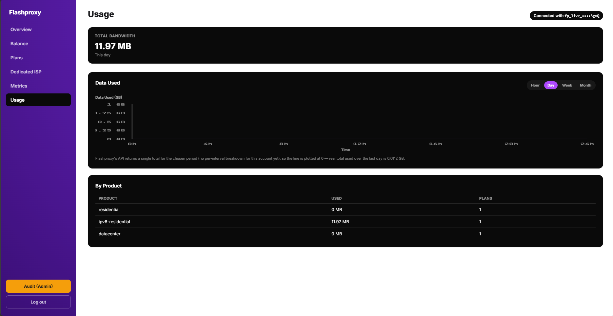

# Flashproxy-2

Standalone Flashproxy reseller dashboard. No browser extension required — runs as a normal local website.



## Why this exists

The [Flashproxy-API-Dashboard](https://github.com/AceOrigin64/Flashproxy-API-Dashboard) browser extension kept hitting CORS errors when fetching the real API directly from the browser. This version sidesteps that entirely: a small Node/Express server proxies API calls server-side, so the browser only ever talks to `localhost` (same-origin, no CORS possible).

## How it works

- `server.js` serves the static UI (`public/`) and proxies any request to `/api/*` over to `https://rapi.flashproxy.com/api/v1/*`, forwarding your `Authorization` header.
- The browser never talks cross-origin to Flashproxy's API directly — only to this local server.
- Login validates against the real `GET /balance` endpoint. No mock data anywhere.
- An `ADMIN_API_KEY` set in a local `.env` file (gitignored, never committed) unlocks an Admin Panel for that one key — audit logging, per-client breakdowns, and client history tracking. Flashproxy's own API has no "admin" or "role" concept; this is purely local to this dashboard.

## Run it

```bash
npm install
npm start
```

Then open **http://localhost:4000** and log in with your real Flashproxy API key.

Optional: create a `.env` file with `ADMIN_API_KEY=your_key_here` to unlock the Admin Panel for that key.

## Files

| File | Purpose |
|---|---|
| `server.js` | Express server: static hosting, `/api/*` proxy to the real Flashproxy API, audit logging, client-history tracking, admin-only internal routes |
| `.env` | Local-only, gitignored. Holds `ADMIN_API_KEY` |
| `audit.log` | Local-only, gitignored. Every proxied API request: time, method, path, masked key, status |
| `clients-history.log` / `clients-snapshot.json` | Local-only, gitignored. Tracks when a client (`end_user_reference`) is first seen or disappears from `/plans` |
| `public/index.html` | Markup for all five pages: Welcome, Login, Dashboard, Admin Panel, Client History |
| `public/styles.css` | Theming (brand purple/blue gradients, orange admin theme, black/white history theme) and page transitions |
| `public/app.js` | Login flow, dashboard views, admin views, all fetched live — no mock data |

## Pages

- **Welcome** — animated intro, brand gradient text
- **Login** — enter your Flashproxy API key, validated against the real API
- **Dashboard** — sidebar nav: Overview, Balance, Plans, Dedicated ISP, Metrics, Sub-Users, Usage, all live. A white "History" button (admin-only, reached via the Admin Panel) and an orange "Audit (Admin)" button appear only for the configured admin key
- **Admin Panel** (orange/white, admin key only) — Users (all clients, active/inactive toggle), Client Information (per-client bandwidth + speed graphs), Reseller Information (this reseller's own active/past plans), Audit Log (every API call this server has proxied)
- **Client History** (black/white, nested inside the Admin Panel) — every client added or removed, with real timestamps, derived by diffing successive `/plans` fetches since Flashproxy's API has no such event log of its own

## Development History

This project grew entirely through iterative chat requests in one continuous session (dated 2026-06-19) — there's no wall-clock timestamp per request, so this is the actual chronological order they happened in, grouped by theme, with the reasoning behind each:

**1. Why this project exists at all**
A separate browser-extension version of this dashboard kept failing with CORS errors when calling the real Flashproxy API directly from a tab page. Rather than keep patching that architecture, the request was to rebuild it as a standalone site with its own server, so the server (not the browser) talks to Flashproxy — sidestepping CORS permanently. That's the whole reason Flashproxy-2 exists as a separate repo from Flashproxy-API-Dashboard.

**2. Getting the live API actually connected**
Once the server existed, the priority was making sure it only ever showed real data: real login validation against `/balance`, real numbers everywhere, no hardcoded/mock keys. This was reaffirmed more than once — at one point a hardcoded-key shortcut was tried and then explicitly reversed, with the instruction to only ever use the live API and only allow login with a genuinely authorized key.

**3. Branding and animation passes**
Several rounds went into matching flashproxy.com's actual look: pulling real hex colors from the live site's CSS, adjusting the Welcome/Login page gradients and text colors repeatedly (purple shade tweaks, light-purple vs cyan accents, font sizing), and reworking the intro animation (letter-by-letter reveal, removing the reveal from the Login page specifically, slowing/speeding transitions). Each pass was a direct visual correction after seeing the previous result — "too big," "not visible," "make it lighter," etc.

**4. Building out the real dashboard views**
Overview, Balance, Plans, Dedicated ISP, Metrics, Sub-Users, and Usage tabs were built one at a time against the real API. Several required bug fixes once real API responses didn't match the docs' example shapes (e.g. `/plans` returns `data.plans`, not `data.items`; `/sub-users` returns `sub_users`, not `items`) — those were fixed by checking the actual OpenAPI spec (`/openapi.json`) rather than guessing.

**5. Graphs and the "no time-series" constraint**
Throughput and usage graphs were requested with hour/day/week-style toggles. The real API only exposes a single aggregate value per requested window (no per-minute history endpoint), so every graph here plots a real axis and real toggle, but the line sits at 0 with the actual aggregate number shown as a caption — chosen deliberately over fabricating a fake trend line. The toggle intervals were corrected partway through from 24h/48h/72h/1w/2w/3w to the simpler 1hr/3hr/6hrs/12hrs/24hrs format, which became the standard for every later graph.

**6. The Admin Panel**
Requested as a way to see "who is using the dashboard and what they do," with the design (auth, access control, logging) left open. The approach taken: an `ADMIN_API_KEY` in a gitignored `.env` (never the literal key hardcoded into committed source, to avoid leaking it via GitHub), an orange-themed panel only that key can reach, with Users / Client Information / Reseller Information / Audit Log tabs added one at a time. "Reseller Information" originally included a "future purchases" section, which was removed once it became clear Flashproxy's API has no scheduled-purchase concept — nothing to show there truthfully.

**7. Client History**
A follow-up to the Admin Panel: track every client ever added or removed. Flashproxy's API doesn't expose this as an event log, so the server diffs the client list (`end_user_reference` values) on every `/plans` fetch against a saved snapshot, logging real "added"/"removed" events. Originally placed as a button on the main dashboard, then moved (per explicit correction) to live only inside the Admin Panel, gated the same way as the rest of the admin features, since it shouldn't be visible to non-admin resellers.

**8. Polish pass**
Final round of smaller corrections: pill colors, font choices for graph axes (JetBrains Mono for a more "formal/robotic" numeric look), Mbps→MBps unit conversion with a proper 0–60 grading, sorting active clients above inactive ones regardless of join order, and a clickable/animated Flashproxy brand link in the sidebar that opens the real flashproxy.com site.

Every step above was a direct response to a specific request in chat — nothing here was built speculatively ahead of being asked for.


A Concluding Summary:


I tried to add a readme as I go, but the process turned out to be quite inefficient and troublesome, so adding a proper readme at the end of the project:

First Webpage of the website is a warm Purple Hue Grant Welcome that might be a bit different from the theme perspective of the said company, but it seemed like a proper balance as the next page is an API autenticator page which follows the flashproxy website theme (at least color-wise), so wanted to put a webpage that stands out a little differently from clicking onto the dashboard option on the flashproxy server to the authenticator webpage which both has the same color theme


The Second Webpage is just a traditional API Authenticator page, where I tried to tidy everything up to look as good as I can, while maintaining functionality and simplicity, as I didn't want to overwhelm the resellers with information overload. In terms of functionality, I made sure you can only log in through a valid API key authorized by the Flashproxy servers through the api.json file provided


The Third Webpage is the actual Dashboard, here I tried to break every bit of information into separate sections or tabs for ease of consuming said information by the reseller


( The first tab is the OVERVIEW tab, which displays the current balance and current active plans across all products. Below I have also added the recent plans they have purchased, and any proxies currently in use by the said resellers' clients

The Second tab is the Balance Tab, where I have also again added a current balance section and a total spent section 

Underneath, there is a Top Up Balance section which i cannot seem to connect to the flashproxy server, maybe a work of a backend which i couldn't figure out

Below that is a transaction history and a pricing tab at which rate the reseller has been providing services to his clients


The Third Tab is the Plans Tab, where I have added all the active and inactive plans (in toggle system) for the reseller.

Below it I have also added their top picked product and the frequency of their purchase.

And at the end, added a Purchase More Options drop-down box, which reveals all the plans provided by FlashProxy at their certain rate, which can be purchased with any balance through the API account that the reseller is using

The Fourth Tab is a dedicated ISP section, which displays all of FlashProxy's available dedicated ISPs 

And the Last 2 tabs are METRIC and USAGE, both of which provide crucial information on Proxy Usage, speed, and Throughput data, but that specific section seems to need a bit of time to load and display information properly.

Must be an optimising issue that I couldn't seem to fix with Claude, and might need some actual backend debugging)

At the bottom of the webpage, I have added a logout button and an Audit (admin) section in orange [that can only be viewed with an admin API key; otherwise, it should not even be visible]

Hence, for the sake of this project, I have made the API key provided by Flashproxy fp_live_***************************************gmQ, an admin key

By logging in through the admin key, you can access the Audit (Admin) section which gives you an admin view of certain other tabs, as such described below:

First Tab "Users": Displays all the active and inactive clients for the specific reseller

Second Tab "Client Information" : Displays all the clients' usage ( active and inactive clients can be toggled on and off) and internet speed stats when they are using the proxy (although the speed stat cannot be synced by actual data since the api.json file possibly doesn't have such said information)

Third Tab is a Reseller Information, which just displays all the Plans Active right now and past plans

And finally, an Audit Log

At the bottom of the Audit (Admin) Dashboard, I have a "Back To Dashboard" tab and a "History" Tab

The "Back to Dashboard" Tab is self-explanatory, but the "History" tab provides all the information of every client this particular reseller has ever added or removed, and that which time stamp and date


Also, at the top of the Dashboard (Reseller Dashboard), where the Flashproxy Name is highlighted to mark the dashboard of the said corporation, I have added a way to access the Flashproxy website by clicking on it


Testing:

Tested through the purchase of a new proxy plan, and every piece of data is logged onto the dashboard as intended, except for the aforementioned USAGE and METRIC tab, where I have already expressed some technical issues happening that are beyond the scope for me to fix or my AI to help

Apparently, for the USAGE tab, my AI shows me this error:

"Measured it — not a frontend bug at all. /usage/summary itself takes ~30 seconds on Flashproxy's real server, confirmed by bypassing our proxy entirely and hitting rapi.flashproxy.com directly (also 30s). balance and plans respond in ~0.25-0.3s for comparison. This is a real, heavy server-side aggregation on their end — nothing in our code to fix there.

What I can fix: caching so you don't eat that 30s every time you revisit the tab, and a clearer loading message so it doesn't look frozen/broken."

And for the METRIC tab, this is what my AI tells me the problem is: 

"Root cause found and fixed: the Metrics tab picked the newest plan regardless of product, and Flashproxy's API only supports metrics for datacenter, shared_isp, isp_eu, ipv6-residential, ipv6-datacenter — your most recent plan was a residential purchase (from testing the Buy flow earlier), which Flashproxy rejects with 400 METRICS_NOT_SUPPORTED. Now it picks the first active plan whose product actually supports metrics, and shows a clear message if none exist. Verified against the real live API in a headless DOM (jsdom) — tab loads clean, range-toggle click works, zero errors both times. Refresh and check."

Other than that, tested everything, so far everything seems to work as intended

Thank You.........


